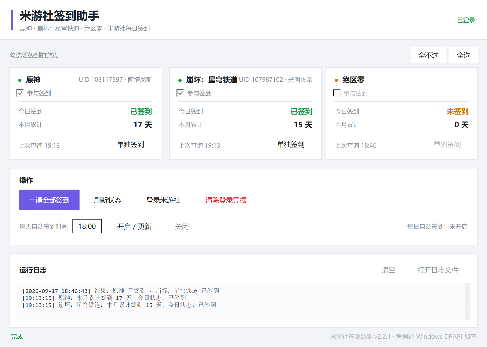

# 米游社签到助手

> **v2.2.1** · [更新日志](#更新日志) · **代码、文档与图标均由 AI 生成（vibe coding）**

原神 / 崩坏：星穹铁道 / 绝区零 每日自动签到，带图形界面。**不用开游戏**，
登录一次后可以一键把勾选的游戏一起签了，也可以交给 Windows 计划任务
每天在后台静默完成，奖励直接进游戏邮箱。



> 截图中 UID 与昵称为演示数据。

---

## 特性

- **三款游戏** —— 原神、崩坏：星穹铁道、绝区零，想签哪个勾哪个
- **免手动抓 cookie** —— 内嵌拉起系统 Edge 完成登录，从浏览器引擎层读 cookie（含 HttpOnly），不用去 F12 里翻
- **凭据本地加密** —— Windows DPAPI 加密，只有当前 Windows 用户能解密
- **定时签到** —— 一键注册 Windows 计划任务，`pythonw.exe` 后台执行不弹黑窗；错过触发点（关机 / 睡眠）后开机自动补跑
- **免安装便携版** —— 不用装 Python，解压双击即用
- **高分屏适配** —— 声明 DPI 感知 + 按真实缩放渲染，4K 屏字体不糊

---

## 快速开始

### 便携版（推荐，不想装 Python 就选这个）

到 [Releases](https://github.com/mxf133/mys-signin-helper/releases/latest) 下载
**`mys-signin-helper-vX.Y.Z-portable.zip`**，解压后双击 **`米游社签到助手.exe`**。

- 免安装、免配环境，解压到桌面或 D 盘都能跑
- **别放进 `C:\Program Files`** 这类受保护目录，否则凭据和日志写不进去
- 出问题双击 **`自检.bat`**，会生成并打开「自检报告.txt」

### 源码版

```bat
git clone https://github.com/mxf133/mys-signin-helper.git
cd mys-signin-helper
安装依赖.bat                  :: 自动创建 .venv 并装依赖（需 Python 3.10+）
启动米游社签到助手.bat         :: 打开界面
```

也可以点右上角 **Code → Download ZIP**，解压后同样双击这两个 bat。

---

## 使用

| 步骤 | 操作 |
| --- | --- |
| 1 | 打开程序，点 **【登录米游社】**，在弹出的 Edge 窗口里正常登录 |
| 2 | 在卡片上勾选要签到的游戏（默认全选），点 **【一键全部签到】** 验证一次 |
| 3 | 想每天自动签到：填好时间（默认 `09:05`）后点 **【开启 / 更新】** |

之后每天到点由计划任务在后台把勾选中的游戏签一遍。

**命令行**（便携版把 `python cli.py` 换成 exe 本身）：

```bat
python cli.py login                            :: 登录一次
python cli.py sign                             :: 签到界面上勾选的游戏
python cli.py sign --game genshin --game zzz   :: 只签指定游戏（可重复传）
python cli.py status                           :: 查询状态
python cli.py task / untask                    :: 注册 / 删除计划任务
python cli.py doctor                           :: 环境自检
```

`--game` 取值：`all`、`genshin`、`starrail`、`zzz`；不传则跟随界面勾选。

---

## 环境要求

| 项目 | 源码版 | 便携版 |
| --- | --- | --- |
| 操作系统 | Windows 10 / 11 | 同左 |
| Python | **3.10+** | **不需要**（已内置） |
| 浏览器 | Microsoft Edge（系统自带） | 同左 |
| 账号 | 米游社账号，且账号下有对应游戏的角色 | 同左 |

> 只支持国服。国际服 HoYoLAB 需要另一套凭据，暂未适配。

---

## 常见问题

**Q：自动签到时间点电脑没开机 / 在睡眠，会漏签吗？**
不会。任务带「错过后尽快启动」设置，当天内只要开机联网就会自动补跑；
断电好几天也只补最近一次。用电池也会执行。唯一补不回来的是「错过的那一天」
本身 —— 米游社按自然日发奖，跨天就没了。

**Q：提示"cookie 已失效"？**
cookie 有效期约一个月。重新点一次【登录米游社】即可，这是唯一的日常维护点。

**Q：某个游戏显示"签到失败"？**
先点【刷新状态】看卡片上有没有 UID —— 没有 UID 说明该账号在这款游戏下没有角色。

**Q：提示需要人机验证？**
米哈游小概率触发 Geetest，脚本无法通过。手动去米游社 App 签一次，第二天通常恢复。

**Q：按钮点了没反应 / 想知道哪一步坏了？**
跑自检：源码版 `python cli.py doctor`，便携版双击 `自检.bat`。

**Q：便携版启动慢 / 杀毒报毒？**
首次启动要解压上百 MB，稍慢正常。PyInstaller 的包偶尔被误报（自解压行为模式），
加白名单即可；介意就用源码版。

---

## 更新日志

### v2.2.1

**修复：v2.2.0 里整个「操作」面板不见了。** 加游戏勾选工具条时，操作区与日志区
被放到了同一个 grid 单元格，Tk 直接叠加，后放的日志区把操作区整个盖住（功能没坏，
只是点不到）。日志区挪到下一行，并补了一组布局回归测试防止复发。

### v2.2.0

- **新增绝区零签到** —— 三款游戏齐了
- **新增"选择要签到哪几个游戏"** —— 每张卡片一个勾选框 + 全选 / 全不选；
  勾选结果本地保存，重启后保留；至少要留一款
- **命令行支持多选** —— `--game` 可重复传入

### v2.1.1

**修复：错过触发点不再漏签。** 改用 XML 注册计划任务，显式配置
「错过后尽快启动」、电池可执行，执行超时从 72 小时收紧到 1 小时。

### v2.1.0

**新增免安装便携版** + **环境自检 `doctor`**。

### v2.0

首个公开版本：原神 + 崩铁一键签到、Edge 内嵌登录、DPAPI 凭据加密、
计划任务定时签到、4K 高分屏适配。

---

## 隐私与安全

- **凭据只存本机** —— cookie 经 Windows DPAPI 加密写入 `cookie.enc`，
  只有当前 Windows 用户能解密，不上传任何第三方服务器
- **仓库不含凭据** —— `.gitignore` 已排除 `cookie.enc`、`.edge_profile/`、
  `signin.log`、`state.json`、`settings.json`
- **不碰游戏** —— 只调用米游社官方签到接口，不修改游戏文件、不注入进程

---

## 免责声明

本工具仅供学习与个人使用，自动化签到在理论上属于用户协议的灰色地带，
**请仅用于你自己的单个账号，不要用于多账号或高频请求**。
使用产生的任何后果由使用者自行承担。

---

## 关于本项目

本项目是一次 **vibe coding**（AI 结对编程）实践：**代码、文档、图标、打包脚本
全部由 AI 生成**，维护者只负责提需求与测试验收。仓库里的每个版本、每次 bug 修复
（包括 v2.2.1 那个「操作面板消失」的布局 bug 及其回归测试）都是在与 AI 的对话中完成的。

| 角色 | 职责 |
| --- | --- |
| **WorkBuddy** | 运行环境与工具能力：文件读写、命令执行、图像处理、包管理、版本控制 |
| **DeepSeek V4.1 Flash** | 需求分析、架构设计、代码编写、问题排查、文档撰写 |

覆盖内容：米游社接口调研与 `genshin.py` 选型、DPAPI 凭据加密、Playwright 内嵌登录、
多游戏 `GAMES` 注册表重构、4K 高分屏 DPI 修复、银狼图标裁切与 7 档 ICO 打包、
PyInstaller 便携版打包与 `doctor` 自检、计划任务 XML 注册改造。

> AI 生成的代码**不保证绝对正确**，请自行审阅后使用。

仓库地址：<https://github.com/mxf133/mys-signin-helper>

---

## License

[MIT](LICENSE)
