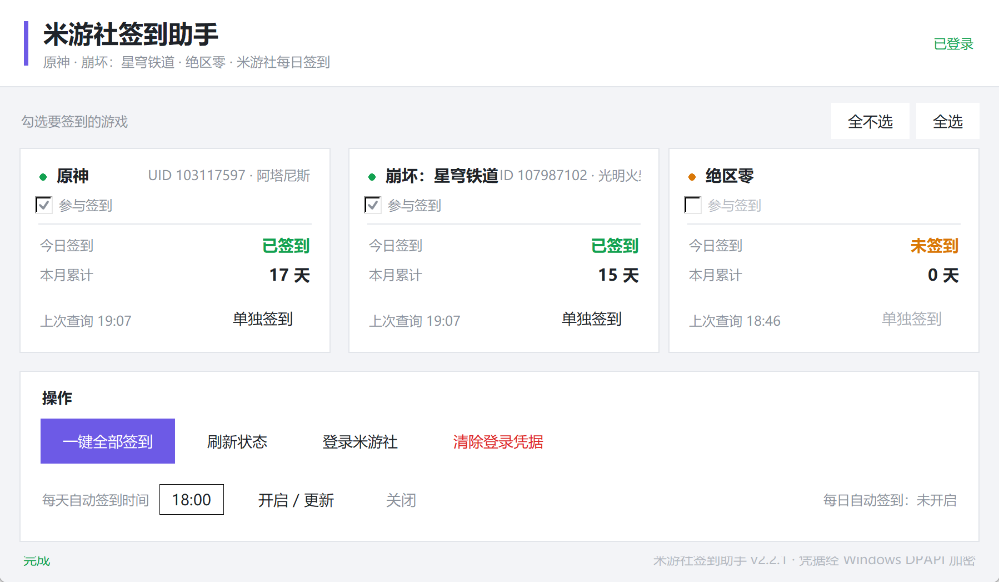

# 米游社签到助手

> **当前版本 v2.2.0** · [更新日志](#更新日志)

原神 + 崩坏：星穹铁道 + 绝区零（国服 · 米游社账号）每日自动签到工具，
带图形界面。

**不需要开游戏**，登录一次之后就能一键把游戏一起签了，还可以在界面上
勾选只签其中几款；也可以交给 Windows 计划任务每天在后台静默完成，
奖励直接进游戏邮箱。



> 截图中的 UID 与昵称为演示数据。

> 本项目由 **WorkBuddy** × **DeepSeek V4.1 Flash** 创建，详见 [创作说明](#创作说明)。

---

## 特性

- **图形界面** —— 每个游戏一张状态卡，实时显示今日签到、本月累计、上次查询时间
- **三款游戏** —— 原神、崩坏：星穹铁道、绝区零，想签哪个勾哪个
- **一次登录管全部** —— 米游社 cookie 是账号级的，登录一次即可
- **免手动复制 cookie** —— 内嵌拉起系统自带的 Edge 完成登录，从浏览器引擎层读取
  cookie（含 HttpOnly），不用去 F12 里翻
- **凭据本地加密** —— 用 Windows DPAPI 加密保存，只有当前 Windows 用户能解密
- **定时签到** —— 一键注册 Windows 计划任务，用 `pythonw.exe` 执行，不弹黑窗
- **高分屏适配** —— 声明 DPI 感知 + 按真实缩放渲染，4K 屏上字体不糊
- **零额外浏览器** —— 复用系统 Edge（Playwright `channel="msedge"`），
  不下载 Chromium

---

## 环境要求

| 项目 | 源码版 | 便携版 |
| --- | --- | --- |
| 操作系统 | Windows 10 / 11 | 同左 |
| Python | **需要 3.10+**（[python.org](https://www.python.org/downloads/) 版本，安装时勾选 *Add Python to PATH*） | **不需要**（已内置） |
| 浏览器 | Microsoft Edge（系统自带即可） | 同左 |
| 账号 | 米游社账号，且账号下有对应游戏的角色 | 同左 |

> 目前只支持国服（米游社的米哈游国服接口）。国际服 HoYoLAB
> 需要另一套凭据，暂未适配。

---

## 安装

### 方式零：便携版（不想装 Python 就选这个）

到 [Releases](https://github.com/mxf133/mys-signin-helper/releases/latest) 下载
**`mys-signin-helper-vX.Y.Z-portable.zip`**，解压后双击 **`米游社签到助手.exe`** 即可。

- 免安装、免配环境，解压到桌面或 D 盘都能直接跑
- **别放在 `C:\Program Files` 这类受保护目录**，否则凭据和日志写不进去
- 出问题就双击 **`自检.bat`**，会生成并打开一份「自检报告.txt」

> 为什么 Release 上的 zip 名是英文？GitHub 会剥掉发行附件名里的非 ASCII
> 字符，中文名上传后会变成 `-v2.1.0-.zip` 这种残名。压缩包**里面**的目录和
> exe 仍然是中文名，不影响使用。

### 方式一：下载源码后一键安装

1. 点右上角 **Code → Download ZIP**，解压到任意目录（路径不要有中文以外的特殊字符）
2. 双击 **`安装依赖.bat`** —— 会自动创建 `.venv` 并装好依赖
3. 双击 **`启动米游社签到助手.bat`** 打开界面

### 方式二：Git 克隆

```bat
git clone https://github.com/mxf133/mys-signin-helper.git
cd mys-signin-helper
安装依赖.bat
```

### 方式三：手动装

```bat
python -m venv .venv
.venv\Scripts\python.exe -m pip install -r requirements.txt
.venv\Scripts\pythonw.exe app.pyw
```

---

## 使用

| 步骤 | 操作 |
| --- | --- |
| 1 | 打开程序，点 **【登录米游社】** |
| 2 | 在弹出的 Edge 窗口里正常登录（扫码 / 验证码都行），登录成功后窗口会自动关闭 |
| 3 | 在卡片上勾选要签到的游戏（默认全选），点 **【一键全部签到】** 验证一次 |
| 4 | 想每天自动签到：填好时间（默认 `09:05`）后点 **【开启 / 更新】** |

之后每天到点由 Windows 计划任务在后台把勾选中的游戏签一遍。

---

## 界面说明

**每个游戏一张卡片**，显示：

- 参与签到勾选框 —— 取消勾选后这款游戏会被跳过（单独签到与一键全部签到、
  自动签到都遵循勾选）
- 绑定的角色 —— 昵称 + UID
- **今日签到** —— 已签到 / 未签到 / 签到失败 / 需重新登录（左侧圆点同步变色）
- **本月累计** —— 本月已签到天数
- **上次查询** —— 最近一次查询时间
- **单独签到** —— 只签这一个游戏

> 至少要保留一款游戏；全部取消时会自动还原并提示。

**操作区按钮：**

| 按钮 | 作用 |
| --- | --- |
| 一键全部签到 | 依次签勾选中的游戏（已签过的会提示"今天已经签到过了"） |
| 全选 / 全不选 | 快速勾选或取消所有游戏 |
| 刷新状态 | 只查询所有游戏的签到状态，不重复签 |
| 登录米游社 | 打开 Edge 完成登录；已有凭据时会提示是否覆盖 |
| 清除登录凭据 | 删除本机保存的登录信息 |
| 开启 / 更新 | 注册（或更新时间）Windows 计划任务，按勾选签 |
| 关闭 | 删除计划任务 |
| 清空 / 打开日志文件 | 日志区操作 |

**运行日志** —— 每一步操作的完整记录，也会写入 `signin.log`。

---

## 命令行用法

计划任务和进阶用法可以直接调 `cli.py`：

```bat
.venv\Scripts\python.exe cli.py login                  :: 登录一次
.venv\Scripts\python.exe cli.py sign                   :: 签到界面上勾选的游戏
.venv\Scripts\python.exe cli.py sign --game all        :: 签到全部游戏
.venv\Scripts\python.exe cli.py sign --game genshin    :: 只签原神
.venv\Scripts\python.exe cli.py sign --game starrail   :: 只签崩铁
.venv\Scripts\python.exe cli.py sign --game zzz        :: 只签绝区零
.venv\Scripts\python.exe cli.py sign --game genshin --game zzz   :: 原神 + 绝区零
.venv\Scripts\python.exe cli.py status                 :: 查询状态
.venv\Scripts\python.exe cli.py task                   :: 注册计划任务
.venv\Scripts\python.exe cli.py untask                 :: 删除计划任务
.venv\Scripts\python.exe cli.py doctor                 :: 环境自检
```

`--game` 可以重复给多次（表示签多款），取值：`all`、`genshin`（原神）、
`starrail`（崩坏：星穹铁道）、`zzz`（绝区零）。**不写 `--game` 就跟随界面上
的勾选**；给了 `all` 则无视勾选签全部。

**便携版**把图形界面和命令行合在同一个 exe 里，把上面命令里的
`python cli.py` 换成 exe 本身即可：

```bat
米游社签到助手.exe sign
米游社签到助手.exe doctor --show    :: 自检并自动打开报告
```

### 环境自检（doctor）

排错先跑这个。会逐项检查运行模式、程序目录是否可写、Edge 是否找得到、
`genshin.py` / `playwright` 是否可用（**会真的启动一次无头 Edge 验证**）、
凭据状态、计划任务状态，并把结果存成 `自检报告.txt`。

---

## 打包便携版

仓库里带了打包脚本，可以自己重新生成免安装版：

```bat
.venv\Scripts\python.exe build_portable.py
```

产物在 `dist_portable\mys-signin-helper-v<版本>-portable.zip`
（解压后的目录与 exe 是中文名）。

脚本会先把源码复制到一个临时目录再交给 PyInstaller —— 这样能确保
`cookie.enc`、`.edge_profile\`、`signin.log` 这类私有文件**不会**被打进发行包，
也顺便避开中文路径在工具链里的编码问题。

---

## 目录结构

**仓库里的文件：**

```
├─ app.pyw                  图形界面主程序（便携版里也兼命令行入口）
├─ core.py                  核心逻辑（登录 / 多游戏签到 / 计划任务 / DPAPI）
├─ cli.py                   命令行入口（计划任务调用的就是它）
├─ 启动米游社签到助手.bat      启动界面
├─ 安装依赖.bat              创建 .venv 并安装依赖
├─ build_portable.py        打包免安装便携版
├─ requirements.txt         依赖清单
├─ icon.ico / icon.png      程序图标（16~256px 七档）
├─ screenshot.png           界面预览
├─ LICENSE
├─ .gitignore               排除凭据、日志与运行环境
└─ .gitattributes           换行符规范（.bat 强制 CRLF）
```

**首次运行后会在本目录生成（已被 `.gitignore` 排除，不会提交）：**

```
├─ .venv\                   Python 运行环境（便携版没有）
├─ cookie.enc               加密后的登录凭据
├─ .edge_profile\           Edge 登录会话缓存
├─ signin.log               运行日志
├─ state.json               各游戏最近一次签到状态
├─ settings.json            界面设置（自动签到时间、勾选了哪些游戏）
└─ 自检报告.txt              doctor 自检的输出
```

---

## 实现要点

- **登录**：用 Playwright 驱动系统自带的 Edge 打开米游社登录页，你正常登录后
  从浏览器引擎层读取 cookie（HttpOnly 的也能拿到），再加密保存。
  与 Snap Hutao 内嵌 WebView 的思路一致，且不额外下载 Chromium。
- **多游戏**：`core.py` 里的 `GAMES` 表声明支持的游戏，对应的接口头是
  `x-rpc-signgame: hk4e`（原神）、`hkrpg`（崩铁）、`zzz`（绝区零）。
  整个流程只建一个 `genshin.Client`，一次登录、一次遍历把选中的游戏签完。
  **想加新游戏只需往 `GAMES` 表里加一行**（`genshin.py` 还支持崩坏3）。
- **勾选要签的游戏**：勾选结果存在 `settings.json` 的 `selected_games` 里，
  `sign_once()` 默认只签勾选中的游戏（显式传 `--game all` 才签全部）。
  读取时做了三重兜底 —— 键不存在、值不是列表、列表里全是无效 key —— 一律
  退回"全部游戏"，因此旧版本升级上来不用改配置。
- **凭据存储**：`cookie.enc`，使用 Windows DPAPI 加密，只有当前 Windows 用户
  能解密，换用户或换机器都无效。
- **定时**：注册名为 `MYS-DailySignIn` 的 Windows 计划任务。源码模式用
  `pythonw.exe` 执行（不会弹黑色命令行窗口），便携版直接让 exe 带 `sign`
  参数跑，因此任务用的是同一个可执行文件。
- **高分屏适配**：启动时先声明 DPI 感知（`SetProcessDpiAwarenessContext`，
  失败则退到 `shcore` / `user32` 的老接口），再按真实 DPI 设置 `tk scaling`
  并用 `px()` 换算所有布局像素。不这么做的话，Windows 会把整个窗口当位图
  放大，4K 屏上字体边缘会被插值糊掉。缩放比例改变后无需改代码，自动适配。
- **环境自举**：`app.pyw` / `cli.py` 顶部会检查当前解释器是否已在项目自带的
  `.venv` 里（比较解释器所在目录而不是可执行文件名，因为 `python.exe` 和
  `pythonw.exe` 是共存的），不在就自动用 venv 重跑一遍，所以直接双击 `.pyw`
  也不会缺依赖。

---

## 更新日志

### v2.2.0

**新增绝区零签到。** 三款游戏现在都在支持列表里，接口头 `x-rpc-signgame: zzz`。

**新增"选择要签到哪几个游戏"。** 每张卡片上多了「参与签到」勾选框：

- 界面里勾选后，【一键全部签到】和每日自动签到都只签勾选中的游戏
- 配套的【全选】【全不选】按钮可以一键切换
- 勾选结果存在 `settings.json`，重启程序后保留
- 至少要保留一款，全部取消会自动还原并提示
- 旧版本升级上来的用户 `settings.json` 里没有这一项，默认全选，行为不变

**命令行支持多选** —— `--game` 可以重复给多次：

```bat
cli.py sign --game genshin --game zzz    :: 原神 + 绝区零
cli.py sign --game all                   :: 签全部，无视界面勾选
cli.py sign                              :: 跟随界面勾选（默认）
```

> v2.1.1 的任务补跑修复对本次升级依然有效；若你用的是 v2.1.1 之前的版本，
> 升级后请把界面里的【每日自动签到】关一次再开一次，让任务用新设置重建。

### v2.1.1

**修复：错过触发点后不再漏签。** 以前用 `schtasks` 命令行方式注册的每日任务带
一组对签到不友好的系统默认值 —— 电脑在设定时刻关机/睡眠就直接跳过，开机也不补跑，
用电池时干脆不执行。现在改用 XML 注册，显式配置：

- **`StartWhenAvailable = true`**：错过后（哪怕断电好几天），下次开机尽快补跑一次
- **电池可执行**：`DisallowStartIfOnBatteries = false`、`StopIfGoingOnBatteries = false`
- 执行超时从 72 小时收紧到 1 小时（签到本来就用不了几分钟）
- `WakeToRun` 保持 false：不为了签到把电脑从睡眠里唤醒

> 已在用旧版本的用户：把界面里的【每日自动签到】关一次再开一次，即可用新设置
> 重建任务。

### v2.1.0

**新增免安装便携版** —— 不再需要自己装 Python：

- 到 Releases 下载 `米游社签到助手-vX.Y.Z-便携版.zip`，解压双击 exe 即可。
  目标机器只需要有 Microsoft Edge（Win10/11 默认自带）。
- 仓库里附了打包脚本 `build_portable.py`，可自行重新生成。
- 体积说明：解压后约 148 MB，压缩包约 61 MB。大头是 Playwright 自带的
  浏览器驱动（106 MB），否则没法驱动 Edge 完成登录。

**新增环境自检 `doctor`** —— 出问题时先跑这个：

```bat
.venv\Scripts\python.exe cli.py doctor        :: 源码版
米游社签到助手.exe doctor --show               :: 便携版（自检完自动打开报告）
```

会逐项检查运行模式、程序目录是否可写、Edge 是否找得到、
`genshin.py` / `playwright` 是否可用（**会真的启动一次无头 Edge 验证**，
这是最容易在打包后失效的一环）、凭据状态、计划任务状态，
并把结果存成 `自检报告.txt`。便携版里也有 `自检.bat` 一键调用。

**便携版的适配改动**（对源码版行为无影响）：

- 程序数据目录不再用 `__file__` —— 打包后 `__file__` 指向 PyInstaller
  的临时解包目录，凭据和日志会在退出时凭空消失；现在冻结模式下改用
  exe 所在目录。
- 计划任务命令在打包模式下改为直接调用 exe 自身（`"...\米游社签到助手.exe" sign`）。
- `app.pyw` 兼作命令行入口：带 `login` / `sign` / `status` / `task` /
  `untask` / `doctor` 参数时不开窗口，直接走命令行逻辑。

### v2.0.1

修复了一批问题，均为功能与提示层面的修正，使用方式没有变化：

- **定时任务不再多起一个进程** —— 环境自举原先比较可执行文件名
  （`pythonw.exe` vs `python.exe`），导致计划任务每次启动都会再拉起一个
  `python.exe` 并在外面干等，任务永远不结束。改为比较解释器目录。
- **cookie 失效后右上角不再误显示"已登录"** —— 原先只看 `cookie.enc` 在不在，
  忽略了 `state.json` 里的失效标记，会和卡片上的"需重新登录"自相矛盾。
- **登录失败时状态栏显示红色** —— 原先只有签到结果参与判定，登录、计划任务
  这类操作失败会显示灰色，容易被忽略；另外部分成功（一个签上一个失败）改显黄色。
- **登录窗口被关闭时提示准确** —— 原先会误报成"启动浏览器失败"。
- **`state.json` 内容异常时不再打不开程序** —— `games` 被写成 `null` 或列表时
  原先会直接崩溃。
- **`read_log_tail(0)` 不再返回整个日志**（潜在问题，当前未触发）。
- **`安装依赖.bat` 重写了 Python 探测** —— 支持 Python 3.14 和官方启动器
  `py -3`；候选解释器一律实测后再采用，并跳过微软商店的 `WindowsApps`
  占位程序（它能被 `where` 找到但跑不起来，会造成误导性的"版本过低"提示）。
  另外流程从多行 `if ( ... )` 括号块改成 `goto` 跳转，`chcp 65001` 提到
  `@echo off` 之后 —— 否则 "中文注释 + 中途切码页 + cmd 对括号块的预读"
  三者叠加会让 cmd 解析错位，控制台冒出 `'xx' is not recognized` 这类
  无意义报错。

### v2.0

- 首个公开版本：原神 + 崩铁一键签到、Edge 内嵌登录、DPAPI 凭据加密、
  Windows 计划任务定时签到、4K 高分屏适配。

---

## 隐私与安全

- **凭据只存本机**：cookie 经 Windows DPAPI 加密后写入 `cookie.enc`，
  只有当前 Windows 用户能解密，不会上传到任何第三方服务器。
- **本仓库不含任何凭据**：`.gitignore` 已排除 `cookie.enc`、`.edge_profile/`、
  `signin.log`、`state.json`、`settings.json`，克隆下来的是干净的代码。
- **不碰游戏**：只调用米游社官方签到接口，不修改游戏文件、不注入游戏进程。

---

## 常见问题

**Q：界面字体发虚 / 模糊？**
程序会声明 DPI 感知并按真实缩放渲染。如果仍然发虚，检查两点——① Windows
设置里显示缩放是不是非整数倍（如 125%、175%），可改成 100% / 150% / 200%；
② 系统"调整 ClearType 文本"是否开启（设置 → 显示 → 高级显示 → 文本渲染，
或运行 `cttune`）。

**Q：自动签到时间点电脑没开机 / 在睡眠，会漏签吗？**
v2.1.1 起不会漏。任务带「错过后尽快启动」（StartWhenAvailable）设置：当天内
只要开机联网，调度器就会把错过的那次自动补上；断电好几天也只补最近一次，
对按天签到的场景刚好够用。用电池也会执行（不插电照跑）。唯一补不回来的是
「错过的那一天」本身 —— 米游社按自然日发奖，跨天就没了。
另外，打开程序界面只会查询状态，不会自动补签；想立刻补就手动点【一键全部签到】。

**Q：签到提示"cookie 已失效"？**
cookie 有有效期（通常一个月左右）。重新点一次【登录米游社】即可，其余不变。
这是这类工具唯一的日常维护点。

**Q：只有原神能签，崩铁 / 绝区零显示"签到失败"？**
先确认该米游社账号下确实有对应游戏的角色。可以点【刷新状态】看卡片右上角有没有
显示 UID——没有 UID 说明这个账号在这款游戏下没有角色。

**Q：提示签到失败、或者提示需要人机验证？**
米哈游有小概率触发 Geetest 人机验证，脚本端无法通过。手动去米游社 App / 网页
签一次即可，第二天通常就恢复正常。

**Q：换了电脑 / 重装了系统？**
`cookie.enc` 依赖当前 Windows 用户的密钥，换环境后必须重新登录一次。
新机器上源码版先双击 `安装依赖.bat` 重建环境，便携版直接解压就能用。

**Q：便携版启动很慢 / 杀毒软件报毒？**
第一次启动要解压上百 MB 的文件，稍慢是正常的。PyInstaller 打的包偶尔会被
杀毒软件误报（因为它是"自解压 + 释放可执行文件"的行为模式），加白名单即可；
介意的话用源码版。

**Q：便携版报"目录不可写"？**
别把它放在 `C:\Program Files`、`C:\Windows` 这类受保护目录，放到桌面、
文档或 D 盘即可。相关检查会出现在 `自检报告.txt` 里。

**Q：界面上的按钮点了没反应 / 想知道到底哪一步坏了？**
先跑自检：源码版 `.venv\Scripts\python.exe cli.py doctor`，
便携版双击 `自检.bat`。

**Q：想改自动签到时间？**
界面上改时间后点【开启 / 更新】即可覆盖旧任务。

**Q：能加别的游戏吗？**
可以。`genshin.py` 还支持崩坏3等，在 `core.py` 的 `GAMES` 表里
加一行（key / 显示名 / `Game` 枚举成员名 / `x-rpc-signgame` 值）即可，
界面会自动生成对应的卡片和勾选框。

**Q：我只想签其中一款游戏，怎么设置？**
在卡片上把不想签的那几款的「参与签到」勾掉就行（或用【全不选】再逐个勾上）。
设置会立刻保存，【一键全部签到】和每日自动签到都会按勾选执行。命令行可以用
`--game genshin --game zzz` 这种形式临时指定，不想被界面勾选影响就用 `--game all`。

**Q：绝区零显示"签到失败"？**
先确认该米游社账号下确实有绝区零的角色（点【刷新状态】看卡片上有没有 UID）。
绝区零的签到接口偶尔会返回 `-5003`（已签到）之外的业务码，重试一次通常就好。

**Q：怎么换程序图标？**
替换 `icon.ico` 和 `icon.png` 两个文件（保持文件名不变），然后重建桌面快捷方式
（如果建了的话）。桌面图标没刷新就按一下 F5。

---

## 免责声明

- 本工具仅供学习与个人使用，自动化签到在理论上属于用户协议的灰色地带，
  **请仅用于你自己的单个账号，不要用于多账号或高频请求**。
- 使用本工具产生的任何后果由使用者自行承担，作者不对账号异常等情况负责。
- 米哈游官方接口如有变更，本工具可能失效，需等待依赖库或本仓库跟进更新。

---

## 创作说明

本项目的全部代码、图标处理与文档，由 **WorkBuddy** 配合 **DeepSeek V4.1 Flash** 创建。

| 角色 | 职责 |
| --- | --- |
| **WorkBuddy** | 提供运行环境与工具能力 —— 文件读写、命令执行、图像处理、包管理与版本控制 |
| **DeepSeek V4.1 Flash** | 需求分析、架构设计、代码编写、问题排查与文档撰写 |

具体来说，从最初的米游社接口调研、`genshin.py` 选型，到 DPAPI 凭据加密、
Playwright 内嵌登录、多游戏 `GAMES` 注册表重构、4K 高分屏 DPI 修复，
再到银狼图标的裁切与 ICO 打包（7 档手写，省掉约 60% 体积）、
v2.1.0 的 PyInstaller 便携版打包与 `doctor` 环境自检、
v2.1.1 的计划任务 XML 注册改造、v2.2.0 的绝区零接入与游戏勾选，
均为 AI 生成并由维护者测试验收。

仓库地址：<https://github.com/mxf133/mys-signin-helper>

---

## License

[MIT](LICENSE)
